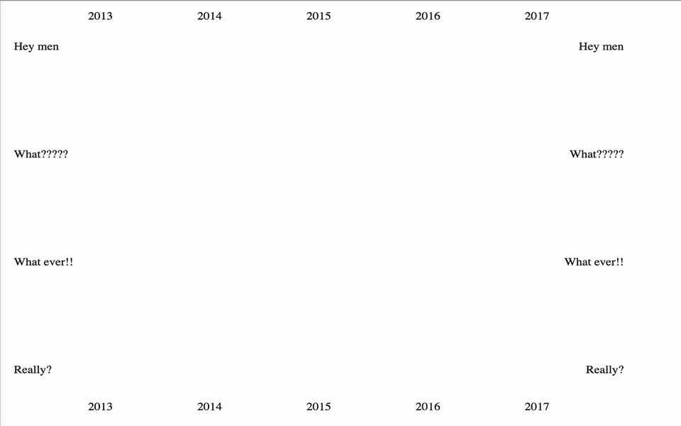

# d3-bubble-matrix

A bubble matrix, for representing any kind of bidimensional data.



## Install

With npm:

    npm install d3-bubble-matrix

With bower:

    bower install d3-bubble-matrix

Dependencies:

    npm install d3
    npm install d3-tip

## Example


```html
<!-- index.html -->
<!DOCTYPE html>
<html>
  <head>
    <link rel="stylesheet" href="css/bubble-matrix.min.css">
  </head>
  <body>
    <div id="bubble"></div>
    <script src="js/bubble-matrix.min.js"></script>
  </body>
</html>
```

```js
let data = {
  columns: ['2013', '2014', '2015', '2016', '2017'],
  rows: [{ name: 'Hey men', values: [0.3, 0.54, 0.99, 0.3, 0.2]},
        { name: 'What?????', values: [0.5 ,0.6, 0.7, 0.8, 0.5]},
        { name: 'What ever!!', values: [0.99  ,0.2, 0.3, 0.4, 0.7]},
        { name: 'Really?', values: [0.94 ,0.07, 0.27, 0.9, 0.5]}]
};
```

```js
let config = {
  // Mandatory need argument root or id
  // root: d3.select('#bubble'),
  selector: '#bubble',
  onClick: val => alert(`Value ${val}`)
};
```

```js
let matrix = new BubbleMatrix(config);

// Draw it.
matrix.draw(data);
```

This will draw a bubble matrix. You can find this example in the [app/index.html](/app/index.html) folder.

To play with the example `npm
install`, run `npm start` and go to
[localhost:8000](http://localhost:8000/).

## Constructor

```js
let config = {
  // {HTMLElement} root: The container's DOM element.
  root: d3.select('#bubble'),
  // {string} selector: The selector of the container to use.
  selector: '#bubble',
  // {number} width: The width of the canvas, not the matrix.
  width: 800,
  // {number} height: The height of the canvas, not the matrix.
  height: 600,
  // {function} onClick: The function to trigger when click a bubble.
  onClick: val => alert(`Value ${val}`)
  // {boolean} reverseColor: Reverse the color scale.
  reverseColor: true,
  // {boolean} hideTooltip: Hide the tooltip for the bubbles.
  hideTooltip: true,
  // {function} tooltip: Function to show tooltip, need to have show and hide method.
  tooltip: d3.tip().html(value => 'Value: ' + value),
  // {boolean} hideLeftTitle: Hide the left title.
  hideLeftTitle: true,
  // {boolean} hideRightTitle: Hide the right title.
  hideRightTitle: true,
  // {boolean} hideTopTitle: Hide the top title.
  hideTopTitle: true,
  // {boolean} hideBottomTitle: Hide the bottom title.
  hideBottomTitle: true,
  // {boolean} duration: The duration of the animation.
  duration: 5000,
  // {number} maxRadius: The radius of the circles.
  maxRadius: 10,
  // {number} maxColors: The numbers of colors to used.
  maxColors: 6,
  // {object} padding: Padding for the matrix.
  padding: { top: 20, right: 0, bottom: 20, left: 10 }
 // {object} classNames: The names of the classes used for each element.
  classNames: {
    bubbleMatrix: 'bubble-matrix',
    leftRows: 'left-rows',
    rightRows: 'right-rows',
    horizontalLines: 'horizontal-lines',
    verticalLines: 'vertical-lines',
    row: 'row',
    column: 'column',
    topColumns: 'top-columns',
    bottomColumns: 'bottom-columns',
    rects: 'rects',
    bubbles: 'bubbles',
    color: 'bubble-color-'
  }
};
```

```js
let matrix = new BubbleMatrix(config);
```

### Add more colors

Change the value of maxColors.
```js
  maxColors: 3,
```
Add this classes to the css.
```css
.bubble-color-1 {
  fill: orangered;
}
.bubble-color-2 {
  fill: gold;
}
.bubble-color-3 {
  fill: forestgreen;
}
```

Ready!

## Methods

### chart.draw(data)

```js
let data = {
  columns: ['hello', 'world'],
  rows: [
          { name: 'foo', values: [0.1, 0.3, 0.9] },
          { name: 'blob', values: [0.5, 0.8, 0.2] }
  ]
};
```
  * `data` *Object* Data to represent.

Draw the chart.

Please feel free to open pull requests to make any change.
